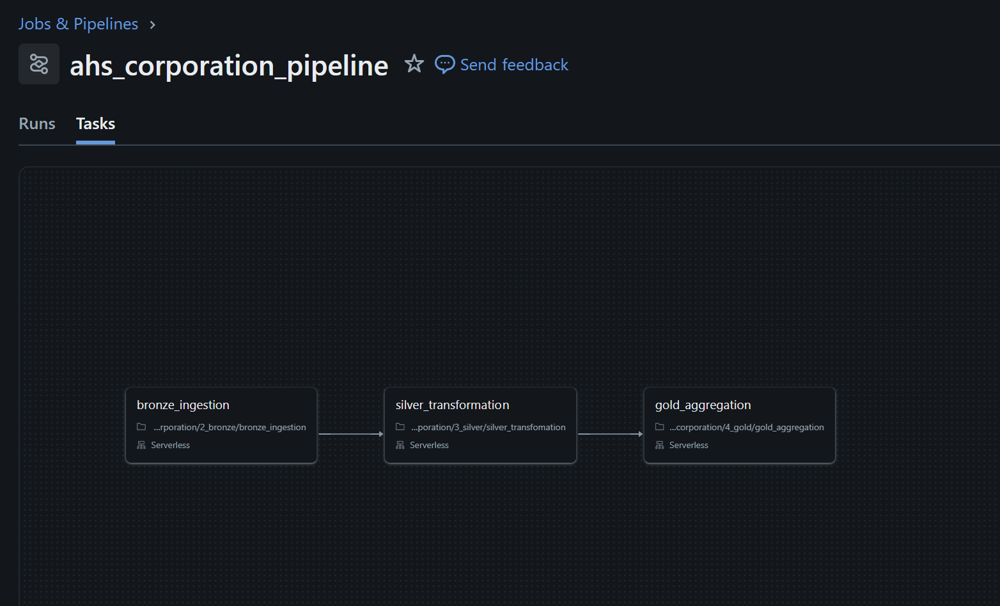

# Databricks Medallion Pipeline — AHS Corporation

## Overview
An end-to-end data engineering pipeline built on Databricks, 
implementing the Medallion Architecture (Bronze → Silver → Gold) 
using PySpark and Delta Lake. The pipeline ingests raw CRM and ERP 
data, applies multi-layer transformations, and delivers a star schema 
ready for business intelligence reporting in Power BI.

## Architecture

## Tech Stack
- **Platform:** Databricks 
- **Language:** PySpark
- **Storage:** Delta Lake + Unity Catalog Volumes
- **Orchestration:** Databricks Workflows (Jobs)
- **Serving:** Databricks SQL Warehouse
- **Source Data:** CRM and ERP CSV files (6 datasets)

## Pipeline Layers

### Bronze — Raw Ingestion
- Reads CSV files from Unity Catalog Volume
- Adds metadata columns (`ingested_at`, `source_file`)
- Writes raw Delta tables with no transformations
- 6 tables: `crm_cust_info`, `crm_prd_info`, `crm_sales_details`,
  `erp_cust_az12`, `erp_loc_a101`, `erp_px_cat_g1v2`

### Silver — Cleansing & Conforming
- Removes duplicates using window functions
- Standardises categorical values (gender, marital status, country)
- Validates and fixes date formats
- Derives and recomputes inconsistent numeric values
- Strips prefixes and extracts keys from composite columns

### Gold — Star Schema
- `dim_customers` — unified customer dimension (CRM + ERP joined)
- `dim_products` — active products with category enrichment
- `fact_sales` — transactional fact table with surrogate keys

## Orchestration
Pipeline automated using Databricks Workflows with task dependencies: bronze_ingestion → silver_transformation → gold_aggregation

Scheduled to run daily at midnight UTC.

## How to Run
1. Clone this repository
2. Upload source CSV files to a Unity Catalog Volume
3. Update Volume paths in `notebooks/2_bronze/bronze_ingestion.py`
4. Run notebooks in order: setup → bronze → silver → gold
5. Or trigger the full pipeline via Databricks Workflows

